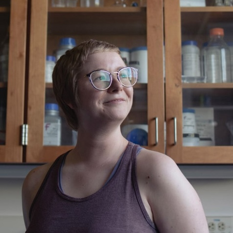
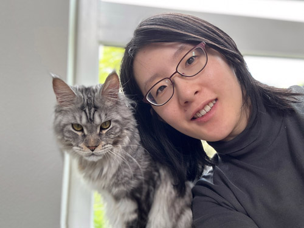
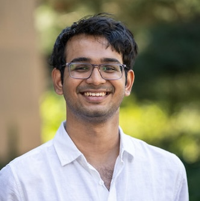

### About

Team Photo  

### Individual Bios  

#### Rebecca Hayes  
Rebecca is a community ecologist that uses field, lab, and computational methods to explore biogeographical questions and host-microbe interactions. They are interested in understanding the biotic and abiotic drivers of bee gut microbiome variation and parasite dynamics. Specifically, they study bee communities in two systems: pristine, high-elevation mountain meadows in the Madrean Sky Islands Archipelago in Arizona and New Mexico and highly human-modified industrial timber plantations in the Oregon Cascades mountain range.  
In the field, they perform bee and plant community surveys and collect insect specimens using hand-netting and passive capture trapping to understand the patterns of diversity of pollinators and floral resources. In the lab, they employ Illumina next-generation sequencing and qPCR techniques to characterize bacterial and parasite communities living in bee guts, as well as the species of pollen they collect. They utilize bioinformatics, Bayesian structural equation modeling, and machine learning methods to infer the causes and consequences of interspecific spatial variation of host-associated organisms and interactions. They are currently working towards a PhD in Ecology and Evolution at University of Oregon. She hopes to expand her data science skillset and grow her professional network through participation in the UW DSSG program.  

#### Himanshu Jaikumar Naidu  
Himanshu Naidu is a graduate student at the University of Washington (UDub), Seattle, pursuing a Masters of Science in Data Science. With a solid background in Computer Vision, Responsible Artificial Intelligence, and Full-Stack Software Development, Himanshu is deeply committed to leveraging data science for societal benefit, which drives his aspiration to join the Data Science for Social Good (DSSG) program. Since Fall 2023, Himanshu has been working on accessibility-oriented projects at the Taskar Center for Accessible Technology.  
His primary focus is on developing semantic segmentation-based applications to automatically identify points of interest that influence accessibility. This work has sparked a keen interest in transit equity, which fueled his interest in contributing to the ‘Investigating Transit Equity Through ORCA Fare Card Analysis’ project at the DSSG program. In addition, he is also involved in the Responsibility in AI Systems and Experiences (RAISE) group at UDub as a student researcher. In this role, he utilizes Knowledge Graphs to address alignment issues related to Large Language Models, furthering his expertise in Responsible AI development.  

#### Siman Ning  
Siman is a PhD student in Urban Design and Planning at the University of Washington. She holds a master’s degree and a bachelor’s degree in Landscape Architecture. Prior to joining UW, Siman worked at Turenscape Design Institute, where she focused on identifying locations for potential green infrastructure. Her research centers on understanding the factors that influence organizational decision-making in climate mitigation and adaptation strategies. Additionally, she is interested in the interaction between human and environmental well-being. Siman is enthusiastic about joining the DSSG program for its unique opportunity to use analytical techniques to tell stories from data and create a positive societal impact.  

#### Ishan Saksena  
Ishan is a Data Science graduate student at the University of Michigan, Ann Arbor, with a Bachelor’s in Computer Engineering from the University of Mumbai, India. He interned at Reliance Jio last summer, working on building their real-time recommendation engine. He’s currently focused on large language models and data-driven marketing as a data science intern at Aug X Labs, a New York-based startup. Having served as the Secretary of an animal welfare nonprofit and being an active community volunteer in Mumbai, he saw the DSSG program as the perfect combination of his two worlds. He is excited to use his technical acumen to solve real social problems.

### More Information

If you are interested in learning more about what we did, please visit [our GitHub page](https://github.com/uwescience/DSSG2024_transit_equity). 

### Acknowledgements

We extend our heartfelt thanks to everyone who contributed to this project. We are especially grateful to the stakeholders who played a crucial role in shaping the direction of our work.

Our sincere thanks also go to the DSSG Program staff, whose dedication made this entire program possible and who provided invaluable guidance throughout the ten weeks.

We are deeply appreciative of the generous support from the Federal Highway Administration and the eScience Institute, which funded this project.

Special acknowledgments go to:
Katie Wilson, Transit Riders Union
Anna Zivarts, Disability Rights Washington
King County Metro
