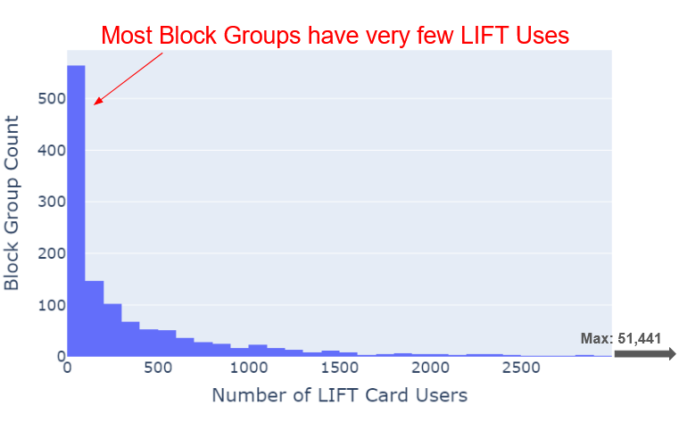

## Overview

In this line of analyses, we were interested in how we can specifically serve low income populations better. We wanted to identify areas where reduced fare cards are not being used adequately. These could serve as potential opportunities to improve the distribution and usage of the reduced fare cards. 

The most prominent card type analysed was the LIFT card, whose trace data is available in the ORCA database. 

## ORCA LIFT Card

The ORCA LIFT card, which provides discounted rides to low-income riders across the Puget Sound area, is the most famous of the reduced fare cards provided by ORCA. In the nearly 10 years since its inception, the LIFT program has become the largest of its kind in the nation, providing our team the unique opportunity to robustly understand the transit patterns of low-income riders in particular. This card is available for all Individuals who have an income below 200% of the Federal Poverty Level. 

In spite of the major success of the LIFT program, there is still room for improvement. Currently, about **18%** of the population in Puget Sound, qualifies for LIFT cards, yet only **4%** of the ORCA cards are actually LIFT. On average, there is only about 1 LIFT card for every 18 individuals who are eligible for it. These high-level statistics indicate that there may be low-income areas where LIFT cards are not adequately utilized. 
There could be a number of reasons for this disparity in different low-income regions:
- The LIFT cards may not have been adequately distributed
- Transit service may not be adequate in general, which means that low-income individuals may not even be using any ORCA card. 
- The low-income individuals may not have a regular need for public transport, hence they may not want to go through the hassle of applying for a card. 

## Problem Statement

The high-level idea is to compare low-income ridership with low-income populations, in different areas. The lowest geography level of granularity, that we intend to use to make these comparisons, is the census block group. 

## Data Sources

- ORCA dataset

The ORCA dataset stores the type of passenger for each ORCA transaction. This could be any one of: Adult (standard fare), Youth, Senior, Low-Income, and other Reduced Fare types. 

For this analysis, we are interested in the subset of transactions for Low-Income passengers. However, the entire dataset was also utilized throughout the analysis for comparison. 

- GTFS dataset

GTFS is the common data format used by all the transit agencies involved in ORCA, for public transportation schedules and associated geographic information. 

Different aspects of the transit system, such as the bus stop locations, can change over time. The GTFS data provided by the agencies can thus, be useful to obtain additional information about the transactions, such as the location of the bus stop at the time it was used.

- US Census Data

The US Census Data can be useful to obtain estimates for low income populations in census block groups. This is useful due to the eligibility criteria (discussed in the 'Low Income Population' subsection.)

## Methods

### Tools

The entire line of analyses was carried out on Python and PostgreSQL. While some of the queries were written directly in PostgreSQL, others were written in a flexible setup in Python, using SQLAlchemy, in order to be able to work with multiple data sources. 

Additional details can be found in the [Github repository](https://github.com/uwescience/DSSG2024_transit_equity). 

## Metrics

### Low-Income Ridership

We could measure ridership of a census block group, using several different but complementary metrics, using the LIFT subset of our ORCA database. For each block group, we can measure the following:

1. Number of total Transactions using LIFT cards to measure the overall usage of the LIFT services in a block group.

2. Number of initial Boardings using LIFT cards to measure the usage of the LIFT services by people who start their trips in a given block group.

3. Number of Unique users who have used the LIFT cards in a block group at least once, to serve as a measure of the number of users who may need to use the transit services in the block group at least once. 

4. Number of Unique frequent users, who have used the LIFT cards in a block group, a certain number of times, to serve as measure of users who need to regularly utilize the transit services in the block group. 

For brevity, the analysis described in this page is on King County, and will mostly revolve around the 3rd metric (Number of Unique users), however, other metrics will be mentioned as and when required. Most of the statistics and plots displayed are for the year 2023. 

### Low-Income Population

The LIFT card is available for all Individuals who have an income below 200% of the Federal Poverty Level. The US census data provides us estimates of these low income populations for each block group. 

## Analysis

The following histogram is for the number of unique LIFT card users across block groups served by ORCA in areas of King County served by ORCA, for the year 2023. 

The distribution is extremely skewed towards the right, with outliers having numbers several times higher than average (aroung 51,000 in the block group covering Downtown). One would also notice that a majority of the block groups have had very few LIFT card users. 

 

In the following map on the left, we see the distribution of the number of unique LIFT card users across block groups. We see similar overall trends as in the histogram: some hotspots (colored in yellow), but most of the areas without much LIFT card usage.

When we compare this to the map on the right, which shows the distribution of the low income populations across block groups, we find noticeable differences in the distribution. Low income populations, are present in significant numbers all over King County. These differences do emphasize the possibility that there are low income areas with low LIFT card usage. These areas could serve as potential opportunities for improving LIFT card distribution.

    <iframe id="lift_card_map" src="https://uwescience.github.io/DSSG2024_transit_equity/assets/geomap/lift_user_counts_st.html" style="width: 350px; height: 500px; border: none;" onload="centerMap('lift_card_map')"></iframe>
    <iframe id="low_income_map" src="https://uwescience.github.io/DSSG2024_transit_equity/assets/geomap/low_income_pop_st.html" style="width: 350px; height: 500px; border: none;" onload="centerMap('low_income_map')"></iframe>

Such potential areas of LIFT opportunity get revealed in the following scatter plot. We start seeing some areas of interest, highlighted here in red. These are block groups with more than 500 low-income individuals, where less than 250 unique cards have been used in the year 2023. 

There are however, some exceptions here. These block groups are within the thresholds, but they are not highlighted in red, are really close to hotspots of lift card usage, so it is possible for any of the lift card users in these areas to travel short distances to other block groups, for transit. 

 

Taking all these factors into account, the following is a map that shows such areas of LIFT opportunity in yellow. Further analysis into the efficacy of these specific areas for LIFT card distribution, could be beneficial.

<iframe id="lift_outliers" src="https://uwescience.github.io/DSSG2024_transit_equity/assets/geomap/lift_outliers.html" style="width: 700px; height: 1000px; border: none;" onload="centerMap('lift_card_map')"></iframe>

## Limitations

In the given line of analyses, we have identified the following primary limitations:

<ol>
  <li> All the metrics for Low-Income ridership are not commensurate with low-income populations for adequate comparison. 
  
  

      The 3rd metric (Number of Unique users) for example, is consistently an overestimate of the low-income riders, since not all the lift users who have travelled in a particular census block group, actually belong to the group. 
  

  

      A more appropriate metric for comparison would be an estimate for the Number of LIFT Card who actually live in a census block group. One possible future direction would be to use the ORCA database to predict these numbers for all the census block groups. 
  

  </li>

  <li> Not all the areas of LIFT opportunity are real opportunities. 
  
  

      As mentioned before, there could be a number of reasons for this disparity in low-income ridership, and this line of analysis will not be able to find which one of these reasons is applicable for an area.
  

  

      We believe the transit agencies would be able to more accurately answer this through their own independent research. The tools that we have provided in this project could help them narrow down areas to explore. 
  

  </li>
</ol>