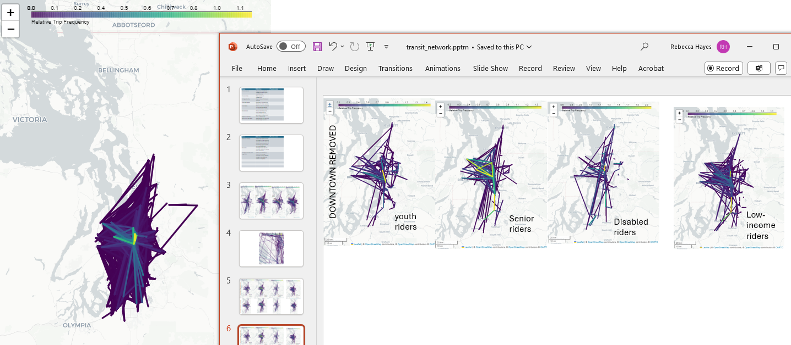

**Findings**
Our findings highlight three key aspects of equity in transit:

Service Quality: This encompasses providing reasonable trip durations for people to reach their destinations, as well as enhancing the quality of stops to improve the rider experience while they wait for their rides.

Spatial Equity: Ensuring that transit services are available where people need them most, addressing geographic disparities in access.

Affordability: Ensuring that transit is accessible and affordable for all segments of the population.

Our network analysis revealed distinct patterns in the most frequent trips across different card user types, as illustrated in the figure below.

 

The initial temporal analysis indicates that certain groups, particularly night shift workers commuting during afternoon and pre-dawn hours, experience significantly longer trip durations compared to those commuting during peak times. These groups also tend to have a higher average number of transfers.

We identified transfer hotspots for each transit agency and recommended equity-based enhancements to their Stop Prioritization Framework, focusing on improving amenities at bus stops.

Additionally, our analysis suggests that block groups with low LIFT ridership and large low-income populations should be prioritized for the next phase of LIFT card distribution. Innovative solutions may be required to address the existing service inequities in these areas.

**Deliverables**

- Jupyter notebook and functions in the public repository that enable rerunning of network analysis and generation of network visualizations by card user type.
- Temporal classification algorithm and SQL code for reproducing the temporal groups
- Transfer hotspots table for each agency, new suggested scoring framework, super bus stops table with 80 columns like Community Assets, Race and Poverty metrics and so on
- A map showing the opportunity area for LIFT program (low income ORCA cards)

**Outcomes**

We are actively collaborating with King County Metro to further develop and communicate our results so that we can maximize the impact of our findings. Two stakeholder presentations are coming in September 2024.
