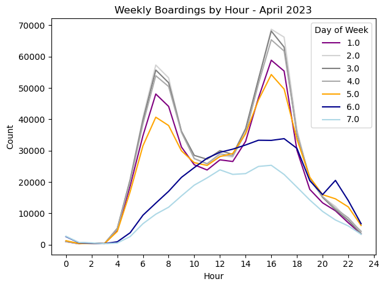
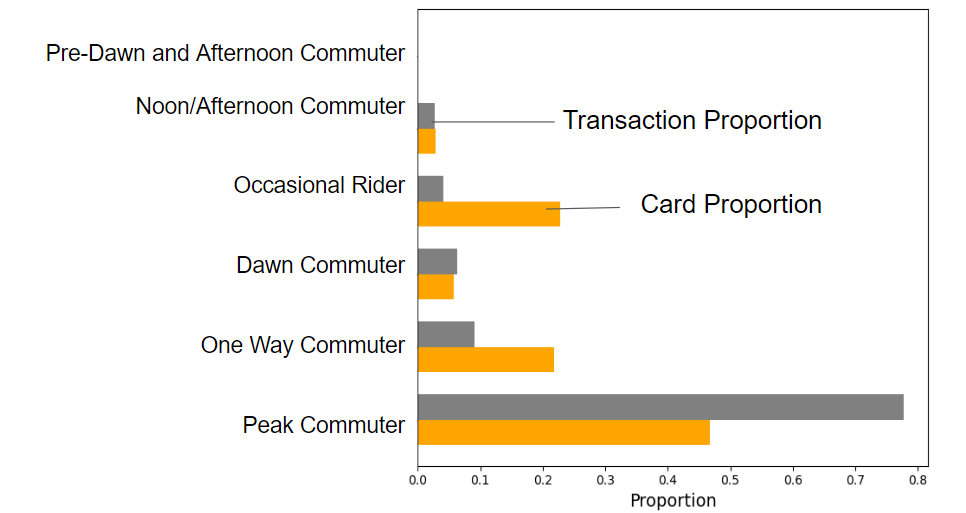
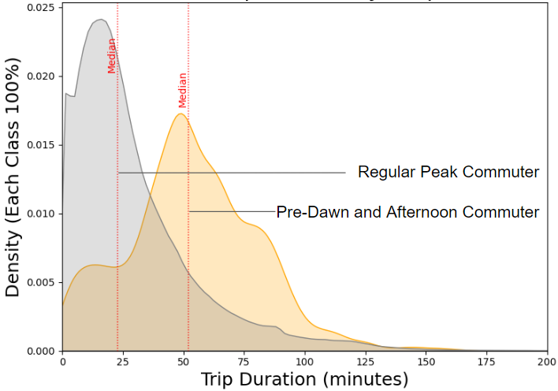

### Research Questions

The ORCA database offers comprehensive information on transit transactions, presenting an opportunity to analyze how users utilize transit services. Before the COVID-19 pandemic, transit usage was more predictable, particularly for employees with 9-5 jobs. However, the shift to remote work and hybrid work models post-COVID has introduced more variability in transit usage patterns. Essential workers, on the other hand, have continued to rely heavily on transit services throughout the pandemic. Transit agencies have adapted their services based on these changing patterns.

The questions we aim to address are:

1. What are the typical types of transit users in the ORCA database?
2. Do certain user groups experience better or worse transit services compared to others?

### Data

We are utilizing the ORCA boarding data to analyze transit usage. Summary statistics of user transactions (excluding transfers) are calculated and grouped by different times of the day. Users are then classified based on their temporal patterns; for instance, a typical 9-5 commuter might have the highest frequency of boardings in the morning and afternoon, with occasional evening boardings.

### Tools 

The primary tools used in this analysis were Python and PostgreSQL, with key packages including pandas and SQLAlchemy. 

### Processes

The process began by using SQLAlchemy to write initial queries, allowing for a better understanding of the data. However, as the complexity of the analysis grew, we transitioned from using SQLAlchemy to raw SQL. This switch provided greater flexibility and efficiency, enabling us to handle more intricate queries and optimize performance.

A heuristic approach to classification begins by analyzing three months of data, filtering out the least frequent users, and identifying key groups such as typical peak-time commuters, noon/afternoon commuters, and weekend users. Further analysis of the remaining data uncovered additional patterns, leading to the emergence of new categories: pre-dawn and afternoon commuters (often night shift workers), short round-trip riders, one-way commuters, and more.

 

### Analyses

The temporal classification resulted in 13 smaller groups and 10 larger groups, though not all are shown here for clarity of reading. 

Our analysis of the temporal categories suggest that the mean trip duration across all temporal categories are not equal. Specifically, the pre-dawn and afternoon riders (mostly night shift workers) have significant longer commute trips compared to typical peak commuter.

Additionally, our findings reveal that LIFT card users are more often associated with peak and noon/afternoon commutes, whereas disability card users have a higher proportion of dawn and pre-dawn trips, as well as shorter round trips.

### Limitations

The major limitation of the process is that the approach is more based on experience and intuition. A future direction of the work is to classify temporal categories using machine learning techniques such as DBSCAN, k-means or hierarchical clustering to check if there are new patterns emerged from the data.
